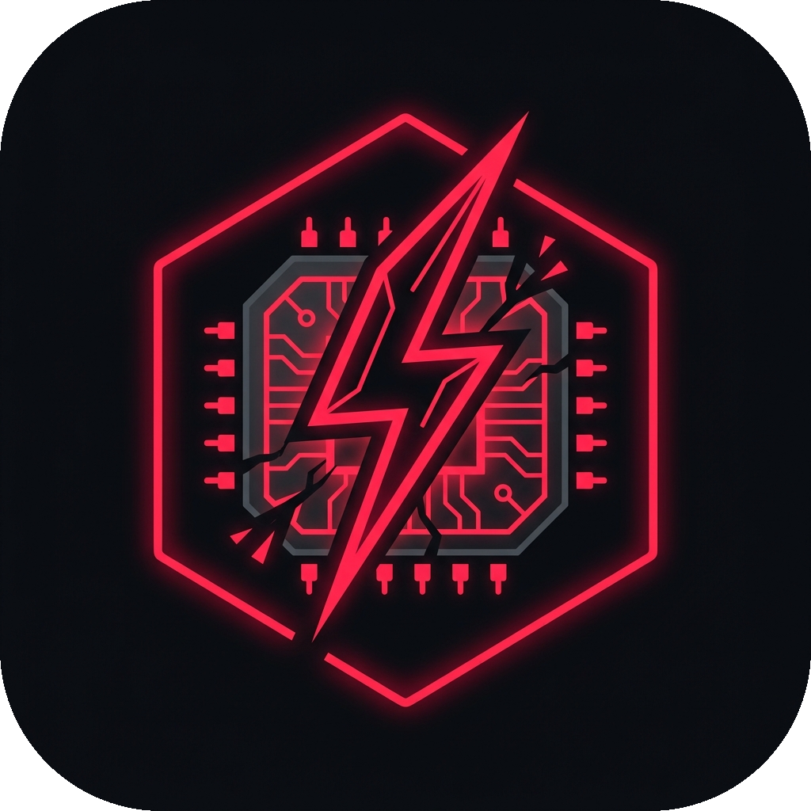

  
  <h1>⚡ PIDKiller - Zero-Trust Game Booster</h1>

A lightweight, zero-trust Windows background optimizer and game booster to maximize FPS and free up RAM.

Unlike other boosters, PIDKiller doesn't just kill apps—it uses a smart "Eco-Mode" to throttle background processes, ensuring maximum FPS while keeping your system stable.

## 🚀 Key Features

- 🛑 **Zero-Trust Eco-Mode**: The moment you launch a recognized game, every single background process that isn't explicitly whitelisted gets its CPU priority dropped to `IDLE`.
- 🔫 **Auto-Kill Sequence**: Automatically terminates massive RAM-hogs (like Browsers, AI tools, and Electron apps) on your Blacklist as soon as a game starts.
- 🔄 **Auto-Restore**: When you close your game, PIDKiller automatically restarts your killed apps (like Discord or Spotify) and resets CPU priorities back to normal.
- 🛡️ **Smart UI Configuration**: A beautifully designed, Cyberpunk-themed UI that groups sub-processes together. Whitelist or Blacklist apps with a single click.
- 🔒 **User-Space Safe**: Currently runs entirely in user-space without requiring Administrator privileges.
- 📦 **100% Standalone**: A single portable executable. Drop it on your Desktop, Taskbar, or anywhere you like. No installation required.

## 🎮 How to Use

1. **Download & Run**: Download `PIDKiller.exe` and place it anywhere (e.g., your Desktop). Just run it!
2. **Auto-Setup**: On its first run, it automatically extracts a starter configuration to your local AppData folder (`%LOCALAPPDATA%\PIDKiller`), keeping your personal settings safe and decoupled from the `.exe`.
3. The UI will open automatically. (You can always right-click the system tray icon and select **Settings** to reopen it).
4. **Games Tab**: Add the `.exe` names of the games you play (e.g., `cyberpunk2077.exe`).
5. **Whitelist Tab**: Add critical apps you never want throttled (e.g., `discord.exe`, `obs64.exe`).
6. **Blacklist Tab**: Add bloatware you want permanently killed during gaming (e.g., `onedrive.exe`, `chrome.exe`).

## 🗺️ Roadmap & Future Development

We are constantly looking for ways to squeeze even more performance out of Windows. Currently, we are researching **optional Admin/Root-level features** to deep-clean memory caches (like the Windows Standby List) and pause stubborn system services, giving hardcore users even more control in the future. 

## 🤝 Contributing (Pull Requests Welcome!)

PIDKiller is built by gamers, for gamers. If you want to help make it better, your contributions are highly appreciated! 

- **Expand the Ruleset**: Help us build the ultimate global `rules.json`. If you know of common bloatware that should be blacklisted by default, or critical system apps that need whitelisting, submit a Pull Request to update our default configuration!
- **Code Contributions**: Have ideas for new features or want to help implement the upcoming optional Admin tweaks? Fork the repo, add your magic, and send a PR!

---
*Built with Python, CustomTkinter, and psutil.*

---

## License

No open-source license. All rights reserved by the author.

**Free to use, including at work.** What is not granted: redistributing,
repackaging or selling PIDKiller.exe. If you want to do any of that, just ask.

Contributions to `rules.json` are welcome and go into the default ruleset.
